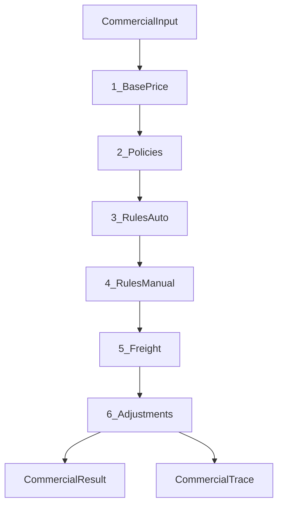

# Motor Comercial — Commercial Engine

Contrato de arquitetura do domínio comercial. **Versão do documento:** 1.0 (2026-06).

Referências: [`DOMAIN_MODEL.md`](DOMAIN_MODEL.md), [`ARCHITECTURE.md`](ARCHITECTURE.md), [`PROJECT_READINESS.md`](PROJECT_READINESS.md).

---

## 1. Propósito

Substituir módulos paralelos (`pricing`, `promotions`, `coupons`, `wholesale`) por um **único Motor Comercial** orientado a **regras**, não a preços isolados.

Toda interação comercial passa por:

```text
Carrinho (ou simulação admin)
        ↓
CommercialEngine.resolve(input)
        ↓
CommercialResult + CommercialTrace
```

Consumidores: carrinho (`cart-context`), simulador admin, mensagem WhatsApp (`PurchaseIntent`), suporte e logs.

---

## 2. Rule Engine (capítulo central)

Toda regra comercial — política, promoção, cupom, campanha futura, cashback, brinde — segue o mesmo ciclo:

```text
Condition → Eligibility → Priority → Conflict → Action
```

| Etapa | Responsabilidade | Exemplos |
|-------|------------------|----------|
| **Condition** | O que deve ser verdade | `minQty >= 10`, categoria `camisas`, canal `wholesale`, data Dia dos Pais, cupom `BEMVINDO10` |
| **Eligibility** | A regra está aplicável agora? | status `active`, dentro de `starts_at`/`ends_at`, canal habilitado na loja, uso não esgotado |
| **Priority** | Ordem quando várias candidatas | inteiro maior = avaliada antes (comportamento atual de promoções) |
| **Conflict** | Acumula ou exclui? | `stackable: false` → uma vencedora por grupo; ADRs abaixo |
| **Action** | Efeito no contexto comercial | desconto %, desconto fixo, frete grátis, brinde, acréscimo, cashback reservado |

### 2.1 Condição vs gatilho

- **Condition** = regra de negócio (qty, categoria, canal…).
- **Trigger** = *como* a regra entra em jogo:
  - `auto` — promoção; motor avalia sozinho a cada mudança no carrinho.
  - `manual` — cupom; só entra se o cliente informar `code` válido.

**Cupom não é módulo separado.** Cupom = registro em `commercial_rules` com `trigger = manual` e `code` único. Mesmo evaluator de Condition/Action das promoções.

### 2.2 Tipos de entidade comercial

| Entidade | Papel | Trigger |
|----------|-------|---------|
| **Commercial Policy** | Política de canal (varejo, atacado, distribuidor) | `auto` (por canal/contexto) |
| **Commercial Rule** | Promoção ou cupom | `auto` ou `manual` |
| **Product policy override** | Exceção por produto (~10%) | herda da policy |
| **Adjustment** | Acréscimo/dedução pós-regras (personalização, taxas) | sempre aplicado se elegível |

Preço final é **consequência** das actions — o motor não pensa “desconto depois desconto”; pensa “qual regra dispara qual action”.

---

## 3. Pipeline de estágios

Ordem **fixa** e versionada (`engine_version`). Nenhum estágio pode ser pulado; estágios sem regras ativas retornam trace vazio naquele passo.

```text
1. Preço base
2. Commercial Policies
3. Rules (trigger = auto)
4. Rules (trigger = manual)   ← cupom
5. Frete
6. Adjustments
```



### 3.1 Preço base

- Fonte: `product.price` (Preço Base único no cadastro).
- `product.promotionalPrice` (legado V1): tratado como **override manual de base** quando `promotionalPrice < price`. Documentado para depreciação gradual em favor de rules/policies.
- **Não** existem colunas atacado/distribuidor/VIP no produto.

### 3.2 Commercial Policies

Substituem o conceito de “Price Tables”.

Política = conjunto de conditions + actions ligados a um **canal de venda** (`retail`, `wholesale`, `distributor`).

Exemplos de actions (V1+):

| Action | Efeito |
|--------|--------|
| `discount_percent` | −10% sobre preço base da linha |
| `discount_fixed` | −R$ 15 por unidade ou por carrinho (ADR por action) |
| `free_freight` | frete zerado (V2) |
| `gift` | brinde (V2) |
| `minimum_order` | bloqueia checkout abaixo do mínimo (V2) |

**Regra esportiva:** política aplica **desconto relativo**, não preço absoluto global por faixa — mix Nike/Adidas/Retrô quebraria tabela fixa R$ 149.

**Override por produto:** `commercial_product_policy_overrides` para exceções (~10% dos SKUs).

### 3.3 Rules (trigger = auto)

Promoções automáticas. Avaliadas após policies.

Estado atual (V1 implementado): `quantity_discount` — ex.: 3 peças → R$ 159 de desconto no carrinho.

Estado alvo: conditions/actions genéricos — ex.: categoria Camisas −15%, Dia dos Pais −20%.

### 3.4 Rules (trigger = manual) — cupons

**Obrigatório:** cupom = `commercial_rules` com `trigger = manual` e `code` (ex.: `BEMVINDO10`).

Input do motor: `CommercialInput.couponCode?: string`.

Validações: código ativo, janela de datas, `usage_limit`, pedido mínimo, categorias elegíveis (conforme conditions). Sem tabela `commercial_coupons` separada.

### 3.5 Frete

| Fase | Comportamento |
|------|----------------|
| V1 | Stub: `freight = null`, trace entry `"Frete: negociado no WhatsApp"` |
| V2+ | Rules/policies com action `free_freight` ou tabela de frete |

Alinhado a ADR de domínio: V1 não calcula frete no site.

### 3.6 Adjustments

Substituem o conceito de “Benefits”. Incluem efeitos **positivos e negativos**:

| Adjustment | V1 | Futuro |
|------------|----|--------|
| Personalização (nome/número) | ✅ acréscimo por linha | — |
| Embalagem presente | — | acréscimo |
| Seguro | — | acréscimo |
| Taxa de montagem | — | acréscimo |

Implementação V1 atual: personalização via settings globais + override por produto — migrará para `apply-adjustments` dentro do motor.

---

## 4. CommercialResult

Estrutura canônica retornada por `CommercialEngine.resolve()`:

```typescript
/** Versão do algoritmo — incrementar quando pipeline ou ADRs mudarem */
export const COMMERCIAL_ENGINE_VERSION = 2

export type CommercialResult = {
  engineVersion: typeof COMMERCIAL_ENGINE_VERSION
  lines: PricedLine[]
  subtotals: {
    merchandiseBase: number      // soma preços base × qty
    merchandiseDiscountBase: number // base elegível para desconto (produto)
    displaySubtotal: number      // subtotal vitrine (produto + ajustes)
    runningTotal: number         // total intermediário após pipeline
    policyDiscount: number       // efeito líquido das policies
    ruleDiscount: number         // promoções + cupom
    freight: number | null       // null = V1 negociado
    adjustments: number          // personalização, taxas (+ ou −)
  }
  discounts: {
    total: number                // policy + rule (positivo = valor abatido)
  }
  total: number                  // max(0, merchandise + adjustments + freight - discounts)
  applied: {
    policyIds: string[]
    ruleIds: string[]             // auto + manual
    couponCode?: string
  }
  trace: CommercialTrace          // OBRIGATÓRIO — ver §5
  errors: CommercialError[]       // ex.: cupom inválido (não altera total)
}
```

`PricedLine` estende linha do carrinho com `unitBasePrice`, `unitNetPrice`, `lineAdjustments`, `lineTotal`.

Compatibilidade V1: [`CartPricing`](../types/cart-pricing.ts) existente mapeia para subset de `CommercialResult` durante migração (facade em `computeTotals`).

---

## 5. CommercialTrace (obrigatório desde a Fase 1)

**Exigência:** trace não é opcional. Sem trace, suporte e debug de desconto tornam-se inviáveis.

Cada passo do pipeline append uma entrada:

```typescript
export type CommercialTraceStage =
  | 'base'
  | 'policy'
  | 'rule'
  | 'freight'
  | 'adjustment'
  | 'error'

export type CommercialTraceEntry = {
  stage: CommercialTraceStage
  sequence: number              // ordem de execução
  ruleId?: string
  policyId?: string
  label: string                 // human-readable: "Política Atacado", "Cupom BEMVINDO10"
  amount: number                // negativo = desconto; positivo = acréscimo
  status?: 'applied' | 'skipped'
  skipReason?: string
  source?: 'channel' | 'policy' | 'rule'
  metadata?: Record<string, unknown>
}

export type CommercialTrace = CommercialTraceEntry[]
```

### 5.1 Exemplo

```text
Preço base              +R$ 600,00
Política Atacado (10+)   −R$  60,00
Promoção 3 peças         −R$  50,00
Cupom BEMVINDO10         −R$  30,00
Personalização           +R$  40,00
Frete                    (negociado no WhatsApp)
─────────────────────────────────
Total                    R$ 500,00
```

### 5.2 Consumidores do trace

| Consumidor | Uso |
|------------|-----|
| UI carrinho | resumo colapsável “Como calculamos” |
| Admin simulador | debug ao criar regra |
| WhatsApp / PurchaseIntent | resumo textual opcional para atendente |
| Logs / suporte | reproduzir reclamação “desconto errado” |

---

## 6. engine_version

- Constante `COMMERCIAL_ENGINE_VERSION` em código e campo em `CommercialResult`.
- Incrementar quando: ordem de estágios mudar, ADR de acumulação mudar, shape de conditions/actions mudar.
- `PurchaseIntent` deve persistir `engineVersion` + trace resumido (V1.5+) para mensagens antigas interpretáveis.

---

## 7. ADRs de acumulação

| # | Decisão | Detalhe |
|---|---------|---------|
| ADR-1 | **Policies antes de Rules** | Policies alteram contexto de preço/canal; rules auto aplicam depois |
| ADR-2 | **Rules auto não acumulam entre si** | Uma vencedora por avaliação (maior `priority` elegível). Mantém V1 (`stackable: false`) |
| ADR-3 | **Cupom acumula após rules auto** | Cupom (`trigger=manual`) aplica sobre subtotal já afetado por policy + promoção |
| ADR-4 | **Adjustments sempre somam** | Personalização/taxas independentes de conflito entre rules |
| ADR-5 | **Preço base único no produto** | Atacado/distribuidor via policy, não colunas no produto |
| ADR-6 | **Policy usa desconto relativo** | % ou fixo; não preço absoluto global por faixa |
| ADR-7 | **Override por produto** | Exceção explícita em `commercial_product_policy_overrides` |
| ADR-8 | **Frete V1 stub** | Sem cálculo; trace documenta negociação WhatsApp |
| ADR-9 | **Cupom = rule manual** | Sem módulo/tabela `coupons` separada |
| ADR-10 | **Trace obrigatório** | Todo `resolve()` popula `CommercialTrace`; testes assertam entradas |
| ADR-11 | **Sales Channel ≠ Policy** | Canal = origem da venda; policy = condições + desconto + override de gates |
| ADR-12 | **Gates na policy, defaults no canal** | `store_settings.commercial_sales_channels` define defaults; policy vencedora sobrescreve via `accumulation` |
| ADR-13 | **CommercialProfile adiado (V3)** | Tabela/CRUD de Profile só se reutilização real justificar — Fase 2.5 usa `accumulation` em `CommercialPolicy` |
| ADR-14 | **eligibility_strategy extensível** | Fase 2.5: `cart_total` \| `per_product`; schema pronto para `per_category` etc. |
| ADR-15 | **Bases de cálculo separadas** | `merchandiseDiscountBase` (produto elegível), `displaySubtotal` (vitrine), `runningTotal` (pipeline) |
| ADR-16 | **Trace applied/skipped** | Stages bloqueados por gate registram `status: skipped` + `skipReason` |

---

## 7.1 Fase 2.5 — Accumulation gates (implementado)

Sem `commercial_profiles` nesta fase. Comportamento:

1. **Defaults por canal** em `store_settings.commercial_sales_channels` — boolean legado ou `{ enabled, stageGates }`.
2. **Policy vencedora** pode sobrescrever gates via coluna `accumulation` (jsonb parcial).
3. **Pipeline** consulta gates antes de rules auto/manual, frete trace e adjustment trace.
4. **Retail V1** permanece aberto (promo + personalização) — regressão zero.
5. **Wholesale** default bloqueia `allowAutoRules` — promo varejo não acumula.

`PricedCartLine` evoluído: `lineProductSubtotal`, `lineAdjustmentTotal`, `lineDiscountEligibleBase`, `lineDiscountTotal`, `lineDisplayTotal`.

`COMMERCIAL_ENGINE_VERSION = 2`.

## 8. Regras de venda (canais)

Em vez de “tipo da loja” exclusivo (○ Varejo ○ Atacado), configuração **multi-canal**:

```json
{
  "retail": true,
  "wholesale": true,
  "distributor": false
}
```

Persistência proposta: `store_settings.commercial_sales_channels` (jsonb).

Loja define **política padrão** por canal (`commercial_default_policy_id` ou mapa canal → policy_id).

V1 storefront: canal fixo `retail` até UI B2B existir; motor já aceita `salesChannel` no input.

---

## 9. Schema proposto (Supabase)

**Status:** proposta — **não migrar até aprovação pós-Fase-0 e conclusão Fase 1 skeleton.**

### 9.1 `commercial_policies`

```sql
commercial_policies (
  id              text PRIMARY KEY,
  name            text NOT NULL,
  channel         text NOT NULL,  -- retail | wholesale | distributor
  priority        int NOT NULL DEFAULT 0,
  enabled         boolean NOT NULL DEFAULT true,
  is_default      boolean NOT NULL DEFAULT false,
  conditions      jsonb NOT NULL DEFAULT '{}',
  actions         jsonb NOT NULL DEFAULT '[]',
  starts_at       timestamptz,
  ends_at         timestamptz,
  created_at      timestamptz NOT NULL DEFAULT now(),
  updated_at      timestamptz NOT NULL DEFAULT now()
)
```

Exemplo `conditions`: `{ "minQty": 10, "salesChannel": "wholesale" }`  
Exemplo `actions`: `[{ "type": "discount_percent", "value": 10 }]`

### 9.2 `commercial_product_policy_overrides`

```sql
commercial_product_policy_overrides (
  id          text PRIMARY KEY,
  product_id  text NOT NULL REFERENCES products(id),
  policy_id   text REFERENCES commercial_policies(id),
  conditions  jsonb NOT NULL DEFAULT '{}',
  actions     jsonb NOT NULL DEFAULT '[]',
  created_at  timestamptz NOT NULL DEFAULT now(),
  updated_at  timestamptz NOT NULL DEFAULT now()
)
```

### 9.3 `commercial_rules` (evolução da tabela existente)

Tabela **já existe** (`kind = promotion`, `type = quantity_discount`). Evolução proposta:

```sql
-- Novas colunas (migration futura)
trigger         text NOT NULL DEFAULT 'auto'
                CHECK (trigger IN ('auto', 'manual')),
code            text UNIQUE,                    -- obrigatório se trigger = manual
conditions      jsonb NOT NULL DEFAULT '{}',
actions         jsonb NOT NULL DEFAULT '[]',
usage_limit     int,
usage_count     int NOT NULL DEFAULT 0,

-- Deprecar gradualmente: type + config → conditions + actions
```

Backfill V1: `quantity_discount` →  
`conditions: { "minQty": 3 }`, `actions: [{ "type": "discount_fixed", "value": 159 }]`

### 9.4 `store_settings` (extensão)

```sql
commercial_sales_channels   jsonb NOT NULL DEFAULT '{"retail": true}',
commercial_default_policy_id  text REFERENCES commercial_policies(id)
```

### 9.5 O que **não** criar

| Proibido | Motivo |
|----------|--------|
| `commercial_price_tables` | Substituído por `commercial_policies` |
| `commercial_coupons` | Cupom = `commercial_rules` com `trigger=manual` |
| `lib/coupons/`, `lib/wholesale/` | Tudo dentro de `lib/commercial/engine/` |
| Preço atacado no produto | ADR-5 |
| Preço absoluto global por faixa | ADR-6 |
| Admin CRUD completo antes do motor | Ordem de entrega — §10 |

---

## 10. Ordem de implementação

```text
Fase 0  → COMMERCIAL_ENGINE.md (este documento)     ← concluída
Fase 1  → Skeleton motor + trace + engine_version + testes regressão
Fase 2  → Migrations policies + stage policies
Fase 2.5→ Accumulation gates + eligibility_strategy + bases de cálculo (engine v2)
Fase 3  → Rules unificadas + cupom manual + carrinho  [BLOQUEADA até gate 2.5]
Fase 3.5→ Actions Engine (gift, cashback…) — futuro
Fase 4  → Adjustments + frete stub
Fase 5  → Admin CRUD polish
Fase 6  → Trace UI
```

**Exigência:** nenhuma UI admin completa antes do motor e testes de pipeline estarem verdes.

Estado atual do código (pré-motor):

| Arquivo | Papel hoje |
|---------|------------|
| [`lib/pricing/compute-totals.ts`](../lib/pricing/compute-totals.ts) | Orquestra preço + promo qty |
| [`lib/pricing/apply-promotion.ts`](../lib/pricing/apply-promotion.ts) | Única rule: quantity_discount |
| [`lib/commercial/commercial-rules.ts`](../lib/commercial/commercial-rules.ts) | Fetch rules storefront |
| [`context/cart-context.tsx`](../context/cart-context.tsx) | Consome rules + computeTotals |

Destino: [`lib/commercial/engine/`](../lib/commercial/engine/) com facade temporária em `compute-totals`.

---

## 11. CommercialInput (contrato de entrada)

```typescript
export type CommercialInput = {
  items: CartItem[]
  salesChannel: 'retail' | 'wholesale' | 'distributor'
  couponCode?: string
  context: {
    getProductById: (id: string) => Product | undefined
    policies: CommercialPolicy[]
    rules: CommercialRule[]
    personalizationSettings: PersonalizationSettings
    now?: Date
  }
}
```

---

## 12. Testes mínimos (Fase 1+)

- Trace com entradas para base, policy, rule auto, rule manual, adjustment
- Regressão promo qty (3 peças / R$ 159)
- Policy 10+ com −10% em produtos de preços diferentes
- Override por produto
- Cupom inválido → `errors[]` + trace stage `error`, total inalterado
- `engineVersion === 1`
- Ordem de pipeline respeitada (policy antes de rule auto antes de manual)

---

## 13. Glossário

| Termo | Definição |
|-------|-----------|
| **Commercial Engine** | Único motor; substitui pricing/promotions/coupons |
| **Policy** | Regra de canal (atacado, distribuidor…) |
| **Rule** | Promoção (auto) ou cupom (manual) |
| **Adjustment** | Acréscimo ou dedução pós-regras |
| **Trace** | Auditoria passo a passo do cálculo |
| **Preço base** | `product.price`; único preço cadastrado |

---

*Próximo passo: revisão deste documento → aprovação → Fase 1 (código skeleton, sem admin).*
