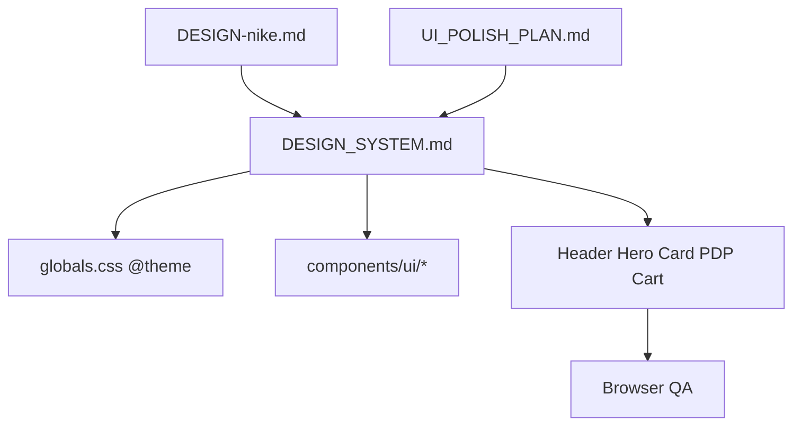

# Design System — Sports Store

**Versão:** 1.0 (documentação)  
**Status:** Fonte única de tokens e specs visuais — **implementação futura** via UI Polish  
**Última atualização:** 2026-06-24

---

## 1. Propósito e regras de uso

Este documento congela regras visuais para que sprints de UI **não inventem** radius, padding, sombra ou grid a cada tela.

| Regra | Descrição |
|-------|-----------|
| **Consulta obrigatória** | Toda sprint UI consulta este doc antes de alterar `components/**` ou `app/**` |
| **Tokens fechados** | Proibido usar valores fora das tabelas §3–§8 sem ADR ou revisão explícita |
| **Spec ≠ implementação** | Este doc define o alvo; o código atual (pré-polish) pode divergir — ver §12 |
| **Anti-cópia Nike** | Princípios de [`DESIGN-nike.md`](../DESIGN-nike.md) traduzidos; sem logos, fontes ou layouts Nike |

**Referências cruzadas:**

- Direção e ordem de implementação: [`docs/UI_POLISH_PLAN.md`](UI_POLISH_PLAN.md)
- Checklists UX/a11y: [`.cursor/skills/ui-ux-pro-max/`](../.cursor/skills/ui-ux-pro-max/)

---

## 2. Identidade Sports Store

**Photography-first · Editorial esportivo premium · Anti-SaaS**

- A **foto do produto** é o protagonista; chrome neutro em volta.
- Layout como **catálogo editorial** — blocos empilhados, ritmo vertical claro.
- Paleta quase monocromática; cor só para **sinal** (promo, estoque, erro).
- Mobile-first; densidade controlada; sem gradientes decorativos ou sombras SaaS.

---

## 3. Palette

### Tokens nomeados

| Token | Hex | Uso |
|-------|-----|-----|
| `ink` | `#111111` | Texto primário, CTAs primários, header logo |
| `canvas` | `#ffffff` | Fundo principal |
| `soft-cloud` | `#f5f5f5` | Superfície de card/imagem produto |
| `charcoal` | `#39393b` | Texto secundário forte |
| `mute` | `#707072` | Labels, meta, breadcrumb |
| `hairline` | `#e5e5e5` | Divisores, bordas de card |
| `hairline-dark` | `#cacacb` | Bordas em fundo escuro |
| `sale` | `#d30005` | Badge promo, preço riscado contexto |
| `sale-deep` | `#780700` | Hover/ênfase promo (raro) |
| `success` | `#007d48` | Em estoque, confirmação |
| `success-bright` | `#1eaa52` | Ícones/check inline |
| `warning` | `#ca8a04` | Alertas admin (futuro) |
| `error` | `#dc2626` | Fora de estoque, validação |

**Proibido pós-polish:** gradientes purple/blue estilo IA, acentos pink/teal/purple editoriais Nike.

### Mapeamento Tailwind futuro (`globals.css` @theme)

```css
@theme inline {
  --color-ink: #111111;
  --color-canvas: #ffffff;
  --color-soft-cloud: #f5f5f5;
  --color-charcoal: #39393b;
  --color-mute: #707072;
  --color-hairline: #e5e5e5;
  --color-sale: #d30005;
  --color-success: #007d48;
  /* ... */
}
```

Uso previsto: `bg-ink`, `text-mute`, `border-hairline`, etc.

### Estado atual (pré-polish)

`app/globals.css` define apenas `--background` / `--foreground` e `font-family: Arial`. Componentes usam utilitários Tailwind genéricos (`gray-*`, `black`, `red-*`).

---

## 4. Typography

### Stack (open-source)

| Papel | Fonte | Fallback |
|-------|-------|----------|
| Body | **Inter** | system-ui, sans-serif |
| Display / headlines | **Barlow Condensed** ou **Oswald** | sans-serif |

> Não usar Nike Futura ND, Helvetica Now ou fontes proprietárias.

### Escala

| Token | Size | Weight | Line-height | Uso |
|-------|------|--------|-------------|-----|
| `display-xl` | 48–56px (mobile→desktop) | 600 | 1.0–1.1 | Hero editorial |
| `h1` | 32–40px | 700 | 1.15 | Título PDP |
| `h2` | 24px | 600 | 1.25 | Seções ("Descrição") |
| `h3` | 18px | 600 | 1.3 | Subseções (Tamanho, Cor) |
| `body` | 16px | 400 | 1.5 | Parágrafos, descrições |
| `body-strong` | 16px | 500 | 1.5 | Labels, nav links |
| `price-xl` | 36px | 700 | 1.1 | Preço PDP |
| `price-md` | 18px | 600 | 1.2 | Preço card |
| `caption` | 14px | 500 | 1.4 | SKU, meta, footer |
| `caption-sm` | 12px | 500 | 1.4 | Legal, badges auxiliares |

**Regras:** headlines PDP/PLP em display condensada; corpo sempre legível (mín. 16px em mobile); preço promo sempre com peso visual maior que preço riscado.

---

## 5. Grid e containers

| Token | Valor | Uso |
|-------|-------|-----|
| `container-max` | `max-w-7xl` (80rem) | Header, main, footer |
| `gutter-mobile` | `px-4` | ≥320px |
| `gutter-tablet` | `sm:px-6` | ≥640px |
| `gutter-desktop` | `lg:px-8` | ≥1024px |

### Layouts de página

| Página | Grid | Notas |
|--------|------|-------|
| **PLP** | `grid-cols-2` mobile · `md:grid-cols-3` · `lg:grid-cols-4` | Gap `gap-4` mobile · `gap-6` desktop |
| **PDP** | `grid-cols-1 lg:grid-cols-2` | Galeria esq. · detalhes dir. · gap `gap-8 lg:gap-12` |
| **Cart** | 1 col mobile · `lg:grid-cols-3` (lista 2 + summary 1) | Summary sticky em desktop |
| **Home hero** | Full-bleed ou container conforme campanha | Ver [`UI_POLISH_PLAN.md`](UI_POLISH_PLAN.md) §2 |

**Padrão container:** `mx-auto max-w-7xl px-4 sm:px-6 lg:px-8`

---

## 6. Spacing

Escala base **8px**:

| Token | px | Tailwind | Uso típico |
|-------|-----|----------|------------|
| `space-1` | 4 | `1` | Gap mínimo entre ícones |
| `space-2` | 8 | `2` | Padding interno chips |
| `space-3` | 12 | `3` | Gap swatches |
| `space-4` | 16 | `4` | Padding card interno |
| `space-6` | 24 | `6` | Gap entre blocos PDP |
| `space-8` | 32 | `8` | Padding seção mobile |
| `space-12` | 48 | `12` | Ritmo entre seções (padrão) |
| `space-16` | 64 | `16` | Hero / footer padding vertical |

**Ritmo de seção:** `py-12 sm:py-16` entre blocos principais; dentro de blocos usar `space-y-6`.

---

## 7. Radius

| Elemento | Radius | Tailwind |
|----------|--------|----------|
| CTAs primários/secundários | Pill | `rounded-full` |
| Badges / chips | Pill | `rounded-full` |
| ProductCard imagem | Flat | `rounded-none` ou `rounded-sm` (2px) |
| Inputs admin | Mínimo | `rounded-sm` |
| Modals/drawers | Superior | `rounded-t-2xl` mobile drawer |

**Proibido pós-polish:** `rounded-lg` genérico em cards e botões (estado atual usa `rounded-lg` — migrar na UI-1).

---

## 8. Elevation e borders

| Princípio | Regra |
|-----------|-------|
| **Default** | Flat — sem `shadow-lg` decorativo |
| **Divisor** | `border-hairline` (`#e5e5e5`) 1px |
| **Card produto** | Fundo `soft-cloud` ou branco + hairline opcional |
| **Header** | Sticky, `border-b border-hairline`, fundo `canvas` |
| **Exceção** | Cart summary sticky — `shadow-sm` ou hairline dupla permitido |

**Proibido:** blobs blur, gradientes decorativos no hero, sombras SaaS em cards.

---

## 9. Components (spec)

### 9.1 Button

| Variant | Fundo | Texto | Border | Radius |
|---------|-------|-------|--------|--------|
| **primary** | `ink` | branco | — | `rounded-full` |
| **secondary** | `soft-cloud` | `ink` | — | `rounded-full` |
| **outline** | transparente | `ink` | `hairline` | `rounded-full` |
| **disabled** | opacity 50% | — | — | cursor not-allowed |

**Sizes:** sm (`px-3 py-2 text-sm`) · md (`px-4 py-2.5 text-base`) · lg (`px-6 py-3 text-lg`)

**Estado atual:** `components/ui/button.tsx` — `rounded-lg`, variants default/secondary/outline. Exporta `getButtonClassName()` para Links estilizados.

**Anti-pattern:** `<Link><Button>` — usar `getButtonClassName()` no Link ou `asChild` futuro.

### 9.2 ProductCard

| Aspecto | Spec |
|---------|------|
| Imagem | Ratio **1:1**, `object-cover`, fundo `soft-cloud` |
| Hover | Opacity ou scale ≤ 1.02 — sem bounce |
| Título | `body-strong`, max 2 linhas (`line-clamp-2`) |
| Preço | Promo em destaque; original `line-through text-mute` |
| Badge sale | `-X%` só se promo; variant `sale` |
| Radius card | Flat (`rounded-none`) |

### 9.3 Badge

| Variant | Uso | Cores |
|---------|-----|-------|
| **category** | Categoria, clube | `soft-cloud` bg, `charcoal` text |
| **sale** | Desconto | `sale` bg, branco text |
| **stock-in** | Em estoque | `success` text ou badge success |
| **stock-out** | Esgotado | `error` text |

**Estado atual:** `components/ui/badge.tsx` — `rounded-full`, variants default/success/warning/error.

### 9.4 Inputs (admin — referência futura)

- Altura mínima 44px (touch target)
- Border `hairline`, focus ring `ink`
- Label `caption` acima; erro `error` abaixo
- Radius `rounded-sm`

### 9.5 Header / Footer chrome

**Header:**

- Altura `h-16`, sticky `top-0 z-40`
- Logo + wordmark; nav `body-strong text-mute hover:text-ink`
- Carrinho outline pill; sem sombra

**Footer:**

- Fundo `ink`, texto `mute` / links `hover:text-canvas`
- Grid 4 colunas desktop; stack mobile
- Hairline superior `hairline-dark`

---

## 10. Motion

Conforme [`UI_POLISH_PLAN.md`](UI_POLISH_PLAN.md) §6:

| Regra | Valor |
|-------|-------|
| Duração | 150–250ms |
| Easing | ease-out padrão |
| Escopo | Feedback add-to-cart, drawer, hover sutil em cards |
| Proibido | Parallax, stagger em grids grandes, bounce/spring exagerado, animar hero/títulos |
| A11y | `prefers-reduced-motion` via `useReducedMotion()` — desabilitar animações |

**Server Components** permanecem estáticos; wrappers `'use client'` mínimos onde motion for necessário.

---

## 11. Anti-patterns

| ❌ Evitar | ✅ Usar |
|-----------|---------|
| Gradientes decorativos (hero blobs) | Fotografia ou fundo sólido `soft-cloud` |
| `<Link><Button>` nested | `getButtonClassName()` no Link |
| `shadow-lg` em cards | Flat + hairline |
| `rounded-lg` genérico | Pill (CTA) ou flat (card) |
| Purple/blue AI gradients | Palette §3 |
| Cor vermelha em elementos não-promo | Vermelho só sale/error |
| Fontes proprietárias Nike | Inter + display open-source |
| Motion em listas longas | Estático + hover mínimo |

---

## 12. Implementação futura

Ordem de execução (sprints UI Polish):

```text
UI-1: tokens CSS em globals.css @theme
      → refatorar button.tsx + badge.tsx
      → header.tsx + footer.tsx
UI-2: sports-hero.tsx + product-card.tsx + grids (home, PLP)
UI-3: PDP + cart + polish final
      → Browser QA
```

Cada sprint: 1 commit local · consultar seções §3–§11 antes de codar.

### Divergências conhecidas (código atual → alvo)

| Arquivo | Atual | Alvo (DS) |
|---------|-------|-----------|
| `globals.css` | Arial, 2 tokens | Inter + @theme palette |
| `button.tsx` | `rounded-lg` | `rounded-full` |
| `product-card.tsx` | `rounded-lg`, hover scale | flat, hover sutil |
| `sports-hero.tsx` | gradientes, blur | editorial, foto |
| PDP | `rounded-lg` galeria | flat ou `rounded-sm` |

---

## Diagrama de dependências



---

**Mantenedor:** atualizar este doc quando tokens mudarem na implementação UI Polish.
